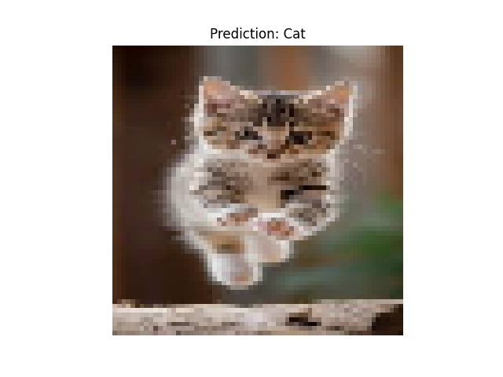

# 🐱🐶 Cat vs Dog Classification using SVM - PRODIGY_ML_03

## 📌 Task 3 - Machine Learning Internship

This project applies a Support Vector Machine (SVM) algorithm to classify images of cats and dogs based on their visual features.

---

## 🎯 Objective

To classify images into two categories:

* Cat
* Dog

---

## 📂 Dataset

The dataset consists of a collection of cat and dog images stored in separate folders, used for training and testing the classification model.

---

## 🧠 Project Workflow

* Data loading and preprocessing  
* Image resizing (64x64)  
* Converting images into numerical format (flattening)  
* Splitting data into training and testing sets  
* Training the model using SVM  
* Evaluating model performance using Accuracy  
* Predicting class for a sample image  

---

## 📊 Model Insights

* Successfully implemented SVM for image classification  
* Achieved good accuracy on a small dataset  
* Demonstrated how image data can be converted into structured numerical features  

---

## 📈 Visualizations

* Prediction output displayed using Matplotlib  

---

## 📷 Output



---

## 🛠️ Technologies Used

* Python  
* NumPy  
* OpenCV  
* Scikit-learn  
* Matplotlib  

---

## ▶️ How to Run

1. Install dependencies:

   ```bash
   pip install -r requirements.txt

2. Run the model:
   
   ```bash
   python model.py

---

## 📁 Project Structure

PRODIGY_ML_03/
│── model.py
│── dataset/
│   ├── cats/
│   ├── dogs/
│── output.png
│── requirements.txt
│── README.md

## 🎯 Conclusion

This project helped me understand how machine learning algorithms like SVM can be applied to image classification by transforming image data into numerical features.

## 👤 Author

Rutuja Jilhawar

## 🔗 Connect with Me

https://linkedin.com/in/rutuja-jilhawar-0a3647291


    
